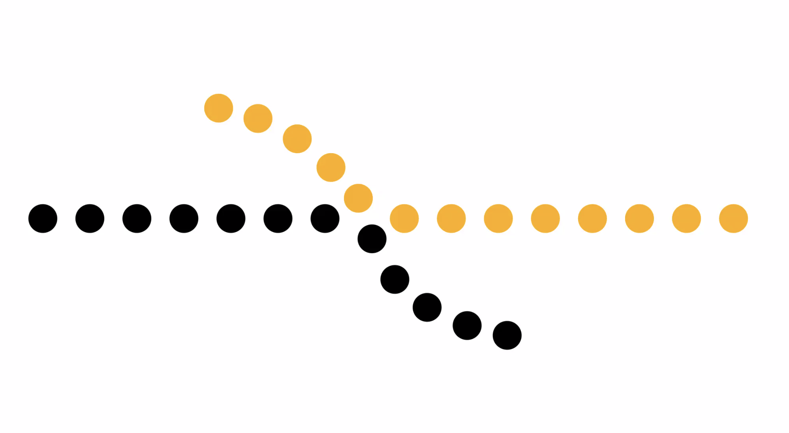
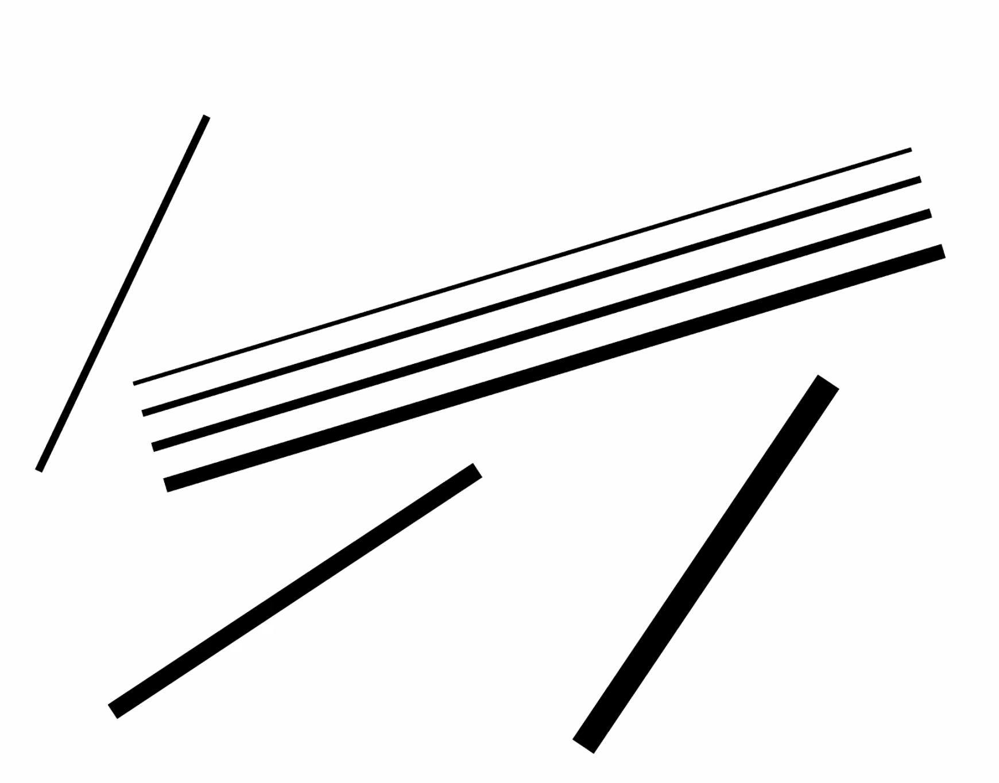
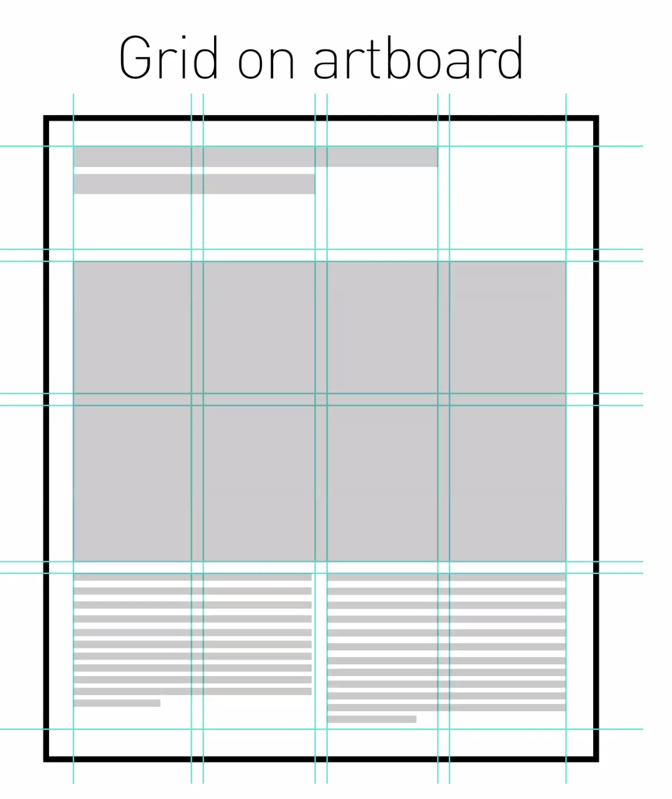
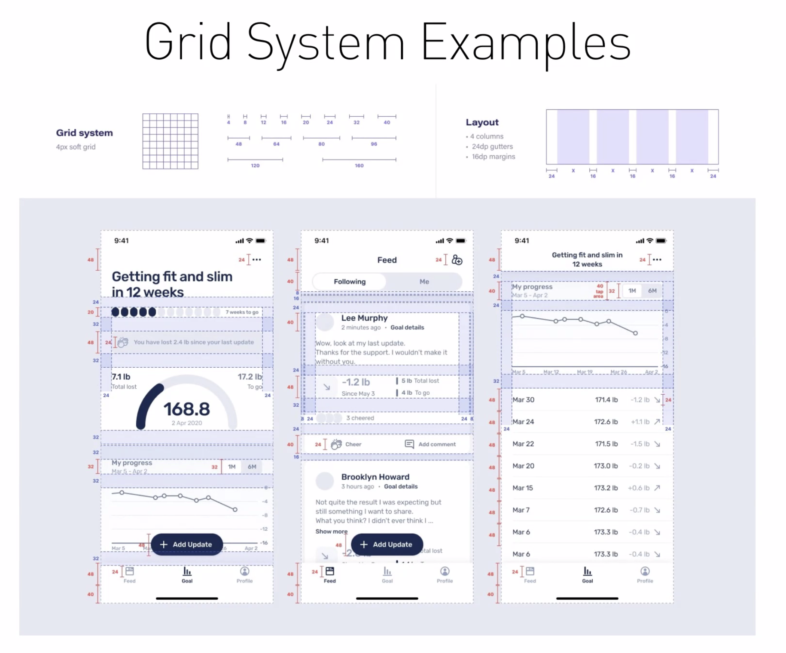
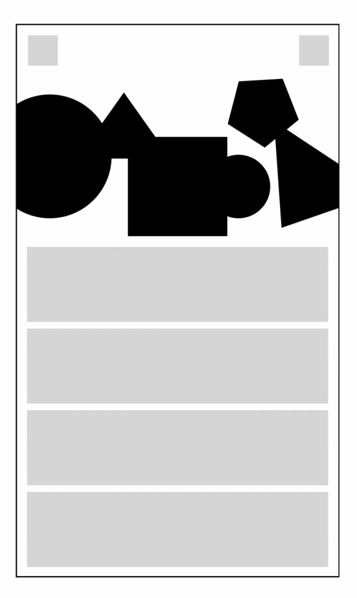
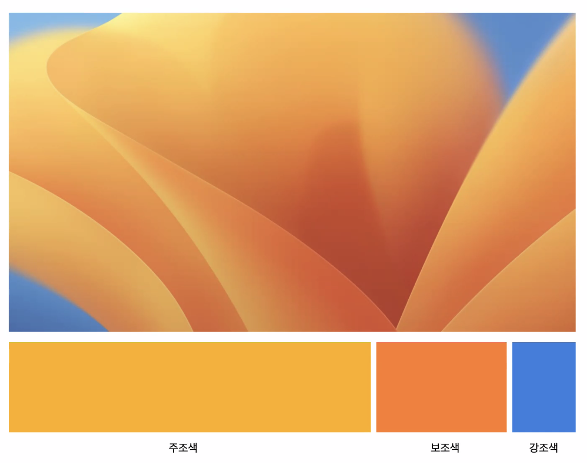

### Gestalt Principles
---

- 게슈탈트 이론과 인지흐름을 알고 있다면 자연스러운 문서 디자인과 지면 디자인이 가능하다.

1. Figure & Ground : 전경과 배경
    - 상호작용이 가능한 대상에 대한 인지를 위한 구별이 필요
2. Connectedness : 게슈탈트 이론의 가장 강력한 방법론
    - 두 물체, 두 버튼의 텍스트 등등이 어떻게 해도 명쾌하게 식별이 어려울 경우 사용할 수 있다.
    - 그럴 땐 그냥 선으로 연결해버리면 된다는 단순한 결론이 `Connectedness` 의 핵심이다.
3. Common Regions : 그룹화와 경계선
    - 사람은 경계선으로 묶인 것들을 하나의 그룹으로 인식한다.
    - 아이패드의 경우에는 자유도가 있는 편인데, 폰은 면적이 좁아서 간격 분리가 쉽진 않다. 그래서 그룹화 경계선 전략을 활용할 수 있다.
4. Proximity : 간격 분리, 거리의 법칙
    - 문단, 자간을 나누는 것처럼 거리를 나누어서 요소를 분리하는 것
    - 서로 가까이 있는 요소들은 관련있는 것처럼 인식한다.

5. Continuation : 연속의 법칙
     
    - 연속되는 순서에 따라 관련있는 것들처럼 보이게 한다.
    - 정렬의 법칙으로 봐도 될듯?

6. Synchrony : 관계의 동일성을 보여주기 위해 같은 포지션과 방향성을 유지하는 것
    - 동일 속성을 가진 요소와 다른 속성 요소는 서로 다르게 처리하는 것

7. Parallesism : 평형하는 요소들은 동일한 속성을 가진 것처럼 보인다.
    
    - 지면 구성이 자유로운 잡지, 인쇄물 등에서 주로 쓰인다.

8. Similarity : 공통점을 두각시켜서 연관성 획득

9. Focus : 집중원칙
    - 여러 요소 중 단 하나만 다른 속성을 갖고 있다면 그곳에 시선이 끌릴 것.

---

### Grid System

- 흰 도화지를 어떻게 활용할 수 있나?
    - Grid System으로 레이아웃 배치를 해보면 어떨까.
- 격자(Grid)는 디자인과 레이아웃에서 굉장히 중요한 개념이다.
    - 지면 위에 가상의 격자선을 그리고 레이아웃을 그려야 정돈되고 균일한 결과를 낼 수 있다.
    
    
    
    - 연습을 많이 하면 할수록 그리드에 대한 이해가 깊어질 것.
- Break The Grid : 그런데,, 그리드에서 빠져나올 수도 있어야 한다.
    - 안정적이지만 밋밋하고 단조롭다.
    - 그래서 의도적으로 그리드 격자를 깨는 요소를 추가하거나 색상에 변화를 주기도 한다. 게슈탈트의 Focus 원칙과 유사하다.
    

---

### Color

- 뇌에 가장 강렬한 인상을 주는 것은 모양이 아닌 색이다.
    - 모양은 뇌가 해석해야 하기 때문에 인식 depth가 있다.
- 색 활용에 자신 없으면.. 그냥 흑백해도 된다.
    - 색은 명도, 채도, 밝기로 구성되어 있다(색의 3 요소).

### 색 전략
- 주조색, 보조색, 강조색 3가지를 활용해서 색상 계획을 한다.
- 이름이 강조색, 보조색 이러해도 배치 자체가 강조 위치가 아닌 곳에 있을 수 있다.

