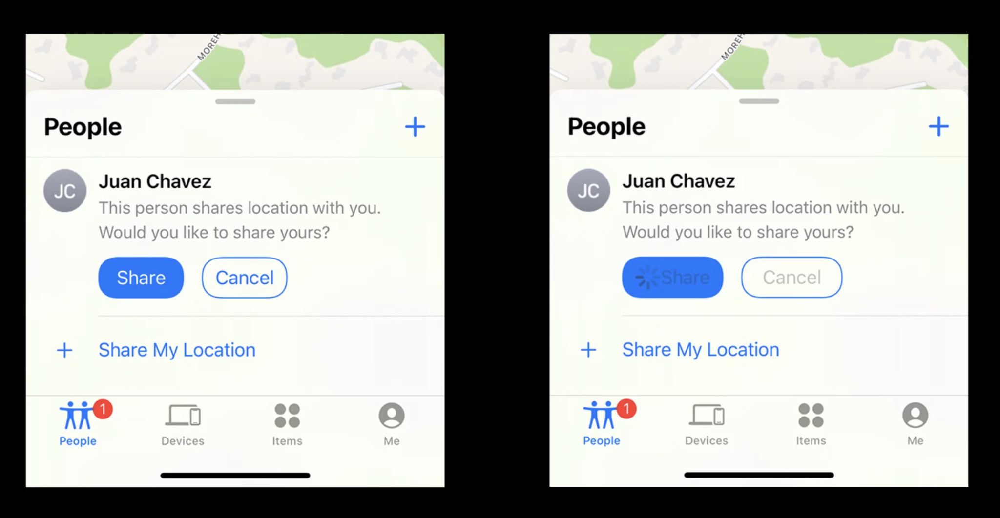
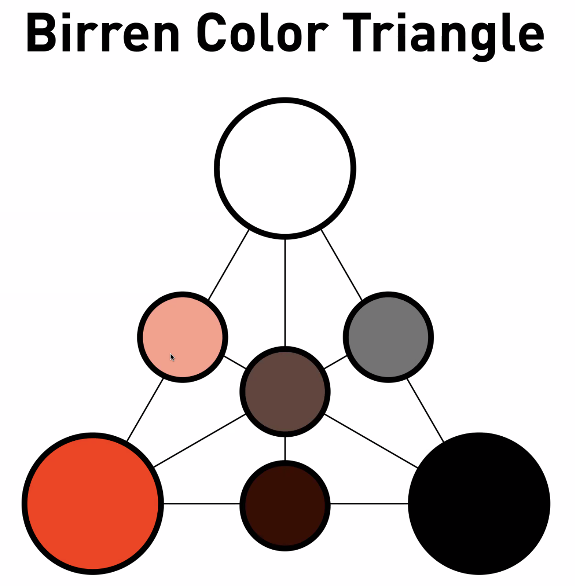

### Human Interface Guide
---

- 하이퀄리티 디자인에 대한 집착이 낳은 문서
    +  오히려 디자인은 공대지식이 더 많이 필요하다. 
    +  눈에 보이는 것은 일부에 불과하며, 디자인의 목표는 예쁘게 보이게 하는 것이 아니라 **문제 해결이 중요한 과제**다.
    +  디자이너들의 사고방식은 **사람의 인지적 문제 해결**을 탐구하는 공학적 성격을 갖는다.
    +  맥락이 일정하게 유지되어야 하며 특정 버튼을 순서에 따라 눌러야 하고, 시인성이 좋아야 하고 등등
- iOS 의 눈높이에 맞는 HIG는 무엇인가?
  
1. HCI(Human Computer Interaction)
    - 1980년 대 시작된 컴퓨터-사람 상호작용 연구, 어떻게 해야 사람은 컴퓨터를 잘 활용할 수 있는가?
    - 한국 학회는 2014년에 공식 출범했다.
    - 심리학과 연관된 인간의 인지를 연구하는 인지 공학(Cognitive Engineering) 에서부터 HCI가 시작되었다.
    - 과거의 컴퓨터는 소프트웨어마다 다 사용법이 달랐기 때문에 커서 움직이는 방법, 컴퓨터 사용법 등등을 교육해야 했다..

    - 그러다가 1970년대 후반 드디어 마우스와 GUI가 등장하고 사람과 컴퓨터의 인터랙션은 더욱 풍부해지기 시작한다. HCI가 나오게 되는 배경!

2. HCI의 목적이자 전부, **Usability & Usefulness(사용성, 유용성)**
   - 얼마나 쉽게 프로그램을 사용할 수 있는가? 프로그램을 사용해서 얼마나 창의적으로 생산을 이루어낼 수 있는가? 인지과학에서 기인한 문제의식이기도 하다.
    - 이 문제의식들을 고려하면서 만든 앱과 그렇지 않은 앱은 꽤 티가 난다.
    - 이 문제의식은 사용자경험으로 이어진다.

3. UX(User Experience)
    - "Every Day Material" 의 저자, 도널드 노먼(Donald Norman)에 의해 정립된 개념
    - 이 아저씨가 애플에 취업을 하는데... 1995년 애플에서는 학교에서 해보지 못했던 것들을 자유롭게 하기 시작한다.
    - "I invetned **the term(= User Experience)** because i thought human interface and usability were too narrow"
    - 사용자 경험은 곧 "**사용감**"을 의미한다. 소프트웨어든 하드웨어든 무언가를 사용할 때의 느끼는 심상과 감정을 총체적으로 의미하는 것.
    - 이것을 더 행복하고 좋게 만들기 위한 개념이 UX 향상이다.
    - 사용감의 옆에는 "**감성**"이 있다. 이 감성은 별 거 아닌 게 절대 아니다. 애플의 감성은 HIG에서 온다. 디자인이 정의된 앱이 주는 브랜드 이미지는 상상을 초월한다.
    - UX 개념이 등장한 이후로 무언가를 만들어 내는 프로세스에 변화가 생겼다.
  
4. HCI vs UX
    - 그래서 어떤 차이가 있나?
    - HCI : 사람과 기계의 상호작용에만 집중
    - UX : HCI를 포함하며 기계의 브랜딩과 이미지를 총체적으로 담고 있는 감성 영역

5. 앱 제작의 General Process(너무 이상적이라서 이렇게 될 리가 없다)
    - 수요 제기 : 고객사와 니즈를 파악
    - 기능 정의 : 수요를 충족하기 위한 기능 파악
    - 화면 기획 : 화면 단위로 기능 배분(설계)
    - **프로토타이핑** : UX 개념의 등장과 함께 중요성이 매우 커진 단계, 사용감의 문제를 찾고 개선하기 위해 진행
        - 종이에 인쇄해서 배치한 UI를 뇌피셜로 굴려보곤 했다.
        - 
    - UX리서치 : 기법이 굉장히 많다. 보여주기 위한 것으로 남아선 안 된다. 메뉴의 이름이 적절한지 알아보는 카드소팅 리서치, 자연스러운 동작에 대한 리서치 등등 각 기법은 뽑고자 하는 데이터가 있기 때문에 이를 적절하게 잘 활용해야 한다.
    - 반복과 개선
    - 릴리즈
    - 사후지원

---
### HIG

- 돌고돌아 HIG.
- 애플에서 개발자에게 권하는 인터페이스 가이드라인.
    - 필수는 아니지만 되도록 따르는 게 좋다.
    - 사용성이 떨어지면 앱 심사 단계에서 보정권고를 받을 수 있다.

1. 레이아웃
    - 인지 흐름과 심리에 영향을 주는 큰 요소.
    - 목표 : 여러 맥락에서 통일된 레이아웃을 유지할 때 콘텐츠 접근성이 높다.
    - 효과 : 앱에 대한 사용 경험이 더 즐겁고 풍부해진다. 훌륭한 UX를 가진 앱은 애플도 좋아한다.
    - **Safe Area** : 네비게이션, 탭, 툴 등등의 필수 요소를 제외한 영역. 아이폰의 다이나믹 아일랜드, 맥의 카메라 하우징 역역 등 인터랙션을 위해 반드시 비워지는 영역을 의미한다. 다양한 화면 맥락에서도 안전 영역을 보장할 수 있다.
        - 디스플레이 크기와 해상도, 색 공간에 대한 차이를 보호할 수 있다. 기기 정렬 방법에 따른 UI 요소 표시 보호가 가능하며 멀티태스킹을 위한 스플릿 뷰도 보호된다.
        - 아이패드의 경우 외장디스플레이 지원, 화면확대, 멀티태스킹 모드 등등을 안전하게 쓰고 싶다면 Safe Area 를 잘 관리해야 한다.
        - 특히 동적으로 UI요소의 글씨 크기가 변화하는 상황을 대응하려면 제대로 확보해야 한다(접근성 -> 글씨 크기)
        - 로케일에 따른 다국어 요소(좌우쓰기), 날짜 표기법, 폰트 스타일과 글자 크기.. 등등 이런거 다 신경쓰고 싶지 않다면? Safe area를 제대로 확보하도록 하자.
    - 애플의 권장사항 :
        - **앱 제작 중 맥락에 따라 다양한 상황을 주고 콘텐츠가 모든 모드에서 올바르게 동작하는지 테스트하라**.
        - 플랫폼마다 화면 내의 공통 UI를 우선 고려하고 Safe Area 를 확보하도록 하라.
        - 화면 내 상대적 중요도를 고려해서 요소를 배치하고 크기의 차이를 두어라.
        - 시각적 그룹핑으로 사용자가 원하는 정보를 찾기 쉽도록 하라.
        - 이미지가 잘리거나 크롭되지 않도록 요소 컨테이너의 종횡비를 고려하라(종횡비가 정해져있지 않으면 절댓값이 화면 구성에 따라 움직이지 않기 때문에 레이아웃이 굉장히 허접해보인다).
        - 글자 크기가 바뀌는 상황을 고려하고, 화면을 넘어갈 때에는 넘어가고 있음을 시각적으로 암시를 반드시 주어라.
        - **터치스크린 버튼 요소는 최소 44x44 이상의 포인트 크기를 갖도록 하라**.

2. SF Symbols(2019? 등장, 애플의 광기)
    - 디자인에 대한 광기..!
    - 헬베티카로 만족하지 못한 애플은.. Apple San Fransisco와 완벽 상응하는 스타일의 심볼 글리프 전용 폰트를 만들어버린다.
    - 심볼을 그림이 아니라 Dingbat Font로 하는 것의 이점은?
        - 다양한 아이콘(심볼) 크기와 웨이트에 대응이 가능하다. 벡터 기반의 곡선으로 그려낼 수 있기 때문에 크기를 계속 키워도 화질이 열화되지 않는다. 두께도 마찬가지의 대응이 가능.
        - 컬러 변경이 용이하고 심볼 이미지 해상도에 구애받지 않는다.
    - SF Symbols Exclusive Features
        - 단색, 계층 컬러, 팔레트, 멀티컬러 기능을 지원한다.
        - 
    - Render Modes
        - Monochrome : 심볼 모든 레이어에 동일 색상
        - Hierachial : SF Symbol Ver3 부터 사용이 가능하며 계층에 따라 투명도 변경 가능
        - 
        - Palette : SF Symbol Ver3 부터 사용이 가능하며 레이어로 구별된 주색과 보조색을 커스터마이징 가능
        - 
        - Multicolor : 애플이 정해준 멀티컬러를 사용할 수 있고 특정한 멀티컬러 심볼의 주 색상은 변경할 수 있다.
        - 
        - Variable Color(**SF Symbol 2022**) : variableValue 값에 따라(변수 변경만으로!) 아이콘 색 상태를 변경시킬 수 있다!
        - 
        - Variable Weights and Scales, Cap Height 등등을 다 아이콘과 글자의 사이즈도 맞춰놓았다..
        - Custom Symbol도 가능하다..!
---

### HIG 2

- `Button` : 유인원을 사람으로 만들어보자.
    - 네모 버튼이 흔하고 토글도 버튼이다.
    - 팝업 버튼도 있다.
    - segmented Controls: 흔하게 우리는 탭이라고 부른다.
- 버튼에서 제일 중요한 건 아래의 2가지 개념이다(타이포그라피와 동일).
    - 44 x 44 보다 커야 화면 탭이 가능하다(권고사항).
    - Legibility : 이독성(눈에 잘 보이는 정도)
    - Readability : 해독성(얼마나 이해하기가 좋은가)
    - 버튼 사이의 margin을 잘 지켜야 한다.
        - 너무 오밀조밀하면 터치가 잘 안되겠지?
- 스타일 :
    - 플레인, 그레이, tinted, filled 4가지 스타일이 있다.
    - 액션의 중요도에 따라 스타일을 다르게 사용한다.
    - 오른쪽으로 갈 수록 액션 중요도를 강조하는 경향이 강해진다.
    - 의미 전달에 도움이 된다면 아이콘을 버튼 라벨에 함께 두는 것도 괜찮다.
    - 다른 앱들을 보면 디자인이 화려해 보여도 버튼 디자인 크게 벗어나지 않는다.
    - 다시 말하면, 버튼만 제대로 디자인해도 완성도가 높아보인다.
    - 버튼 크기보다는 스타일에 집중하는 편이 좋다(small, medium, large << plain, gray, tinted, filled).
- 레이블
    - 짧고 간결하게 준비하고, 눌렀을 때의 동작에 대한 동사를 쓰자.
        - 장바구니로 vs 장바구니 담기
    - 버튼에는 항상 설명이 되는 텍스트를 넣어야 한다.
        - 시리가 버튼을 읽어야 하기 때문에(접근성)
        - 텍스트를 쓰기 싫으면 tag라도 달아야 한다(그래도 텍스트 써라).
- delayed action
    - 버튼을 누르고 동작이 도는 동안 버튼 레이블이 해당 작업이 진행되고 있음을 알려라. sf Symbols -> rays를 찾아봐
  

- 버튼의 역할에 대한 고민
    - 평범한 역할 : 특수 목적이 아닌 버튼
    - 주요한 역할 : 대부분의 사람들이 화면에서 선택해야'만' 하는 역할
    - 취소 역할 : 기존 액션을 취소하는 역할
    - 파괴 역할 : 데이터를 파괴하거나 삭제하는 역할
        - 파괴 역할 버튼의 경우에는 filled 버튼으로 만들어야 한다.
        - 파괴 역할 버튼에는 주 역할 동작을 할당하지 말라.

- `Box`
    - 콘텐츠를 담는 박스
    - 화면이 좁은 앱 공간에서 그룹을 구분하는 적극적인 방식이다.
    - 테두리, 배경색으로 인터페이스를 구분한다.
- Basic Rules
    - 박스는 뷰 크기 보다는 작아야한다.
    - 패딩과 콘텐츠 정렬로 박스 내 콘텐츠 정보 그룹 구성을 고려하면 좋다.
    - 콘텐츠 소개할 때 도움이 될 것 같다면 제목을 달아도 좋다.
        - 제목을 쓰면 짧은 설명도 써주자. 

- List and Tables
    - 행 기반 형식일 경우 텍스트를 꼭 사용하라(접근성 시리 읽어주기 이슈)!
    - 이미지 나열에는 List가 아니라 Collections를 사용한다.
    - 선택했을 때 피드백을 준다.

- Collection
    - 표와 유사하지만 이미지 컨텐츠를 주로 담는 컨테이너.
    - 스유는 Collection이 없어서 LazyGrid를 쓴다.
- Basic Rules
    - 가능하면 그리드 레이아웃 쓰는 것이 좋다(괜히 다른거 커스텀하지 말고).
    - 이미지크기와 주변 패딩을 확보해서 탭하기 좋게 하라. 
    - 텍스트 보여줄 거면 List, Table을 써라.
    - 필요하다면 커스텀 인터랙션을 연결한다.
    - 항목 삽입, 삭제, 재정렬을 할 때에는 알맞은 피드백을 준다.

- `Search Bar`
    - 검색, 지우기버튼, 플레이스홀더가 포함된 텍스트필드

- Basic Rules
    - 플레이스홀더는 필수로 제공한다.
    - 검색필드 근처에는 유용한 기능(바로가기, 기타 콘텐츠)을 제공하면 사용성이 개선된다.
    - 검색 시작 타이밍을 잘 고려해야 한다(검색 버튼을 누르고 할까 아니면 검색어를 받을 때마다 할까).
    - 내용 지우기 버튼 포함 권장
    - 스코프 바를 두어서 검색 영역을 선택하게 하라. 
    
---
### HIG 3

- Gestures
    + 터치스크린 인터페이스에서 제스쳐는 핵심이다.
      개발자로서 제스쳐를 만들고 다루기는 굉장히 어렵다(UIKit보다 스유가 더 어렵다 아직은).
      핀치, 매그니피케이션 제스쳐를 동시에 쓰기가 어렵다.
    + 기본 규칙 :
      1. 다른 모든 앱과 같은 형태의 제스쳐를 사용해야 한다.
      이 통일감은 사람마다의 제스쳐 숙련도를 균일하게 유지하도록 한다(UX 이슈).
        * 어느 각도로 어떻게 핀치를 하는가? 에 따라 각 기기마다 다르게 작용한다면.. 그 앱을 쓰겠어?
      2. 반드시 필요한 경우만 커스텀 제스쳐를 만들어 사용해야 한다.
      3. 적절한 콘텐츠에서 적절한 제스쳐가 적용되어 있는지 고려하라.
      4. 시스템의 기본 제스쳐인 모서리 제스쳐는 방해하지 말아야 한다.
    + 제스쳐 목록

---
### HIG 4
- Playing Audio
    - 무음 모드에서는 미디어 재생, 알람처럼 사람이 의도한 오디오만 재생해야 하고 앵간하면 자동재생은 꺼야 한다.
    - 기본적으로 음소거를 해두고, 유저가 그걸 탭하면 들을 수 있도록 해야 한다.
    - 헤드폰을 벗거나 무선 연결이 해제될 때에 사운드 재생이 일시 정지되어야 한다.
    - 볼륨 레벨을 가급적으로 별도 조절하고 시스템 볼륨 자체는 소프트웨어가 건들지 말아야 한다.
    - 어떤 오디오로 재생할지 오디오 재생 장치지정을 허용하라(블루투스 스피커 쓸래? 에어팟 쓸래?)
    - 시스템에서 지원하지 않는 기능을 제공할 때만커스텀 오디오 플레이어 컨트롤을 생성하고 그게 아니라면 기본 API를 써라
        - PIP도 쉽게 구현할 수 있는데 왜 굳이 새로 만드려고해..?

- Motion
    - 애니메이션 사용을 권장하는 애플.
    - **사용자와 모션을 사용해서 의사소통하라.**
    - 사용자가 흥미를 잃지 않도록 하되, 모션은 꼭 필요한 만큼, 목적에 맞는 만큼만 사용해야 한다.
    - 모션이 정보를 전달하는 유일한 방법이 되어선 안 된다.
        - 모션은 언제나 선택 사항이어야 한다.
    - 빠르고 정확한 애니메이션을 사용해야 한다.
    - 자주 발생하는 상호 작용에서는 애니메이션을 추가하면 안 된다.
        - 할 때마다 애니메이션을 보면 너무 피곤하기도 하고 중요도 계층이 이상해진다.

- Alert
    - 경고창은 자주 쓰이지만 자주 쓰여선 안 된다(?). 드물게 경고하라.
    - 정보 제공을 하기 위해서는 Alert을 쓰지 말라.
    - 데이터 삭제 동작에도 일반적 작업이면 경고가 없어도 된다.
    - 앱 시작할 때 경고 띄우지 말고, 모달 문구를 직접적, 중립적으로 알아듣기 쉽게 명확하게 써라
    - 상황에 명확하고 간결한 제목을 쓸 것
    - 특별 의미를 전달할 때만 추가 설명 텍스트를 작성하고 경고 버튼에 대한 설명은 하지 않아도 된다.

- Colors
    - 앱이 게임이 아니면! 색상 팔레트를 절제해서 써야 한다. 색 정보가 많아지면 사용자가 쉽게 어지럽고 피로해진다.
    - 서로 다른 맥락 컨텐츠에는 색을 서로 다르게 써서 구분해준다.
    - 다크모드, 일반모드 양쪽에서 앱 색이 잘 보이는지 확인해라.
    - 다양한 조명 조건에서 앱 색상 팔레트를 테스트(백열전구 밑에서, LED 밑에서 등등)
    - 디스플레이가 서로 다른 기기에서 앱을 테스트(TrueTone 디스플레이 대응을 위해)
    - 사용자가 커스텀 색상을 사용하도록 허용할 때, ColorPicker 써라.

---
### Colorlogy Basics
- 색상학(HSV)

- 색(Hue)의 구분 요소 : 색상기준 10개, 섞인 정도에 따라 100개의 색상 구분 단계가 있다(먼셀 시스템, 5R, 10Y 등등...).
    - 색은 물체, 표면에 나타나는 것이고, 빨강-노랑-초록-파랑 등 다른 색과 구분되면 독자적인 색이 된다.
- 이미지의 우측에는 5R Hue가 명도, 채도에 따라 변화하는 표가 있는데, value(명도)는 밝은 정도이다. Chroma(채도)는 색의 순수함을 의미한다.
    - 채도(Saturation, Chroma) : 흰색 또는 회색에서 출발하는 색감각의 정도를 의미한다.
    고채도의 색은 순색으로서 색의 시인성이 강렬해진다.
    - 명도(Value) : 색이 제거된 상태에서 색의 진하기를 나타내는 정도를 의미한다.
- 명도와 채도는 한 색 내에서 수많은 변화조합을 만들어낼 수 있다.
- 파스텔 톤은 명도가 높고 채도가 낮은 톤을 대체로 가리킨다.
    - 톤도 과학적인 분류가 있는데, 이건 여유가 되면 다시 살펴보기로.

- 보색과 인접색 : Hues(색상)의 색상환에서 마주보는 사이가 보색 관계.
    - 보색 대비는 가장 강렬한 대비를 일으키지만, 잘못 쓰면 촌티가 난다.

---
### Mixing Color
- RGB(가산혼합색, Red Green Blue) : 색을 더할수록 색이 밝게 변한다(명도, 채도가 커진다). 올레드를 제외한 디지털은 RGB로 표현한다..!

- CMYK(감산혼합색) : 색을 더할수록 색이 어둡게 변한다(명도, 채도가 작아진다). 아날로그 삶에서의 색 혼합이 대체로 이러하며, 인쇄할 때의 색 배합으로 사용된다.

---
### Color Psychology
- Color and Temperature : 모든 색을 계획할 때, **색온도가 제일 중요하고 최우선시된다.**
  
    - 빨간 계통은 따뜻함-안락함, 파란 계통은 차가움-긴장감 등을 준다.
    - 몽글몽글말랑말랑 앱이면 난색 계열을 선택해야겠지?
- Color and Weight : 색은 무게감도 줄 수 있다.
  
  - 명도가 낮을수록, 어두워질수록 무거워진다.
- Color and Mass : 색으로 부피감도 표현할 수 있다.
    
    - 보통은 명도나 채도가 클수록, 부피감도 커보인다.

- Color and Distance : 색으로 거리감을 표현할 수도 있다.

    - 채도와 명도가 높으면 가까워 보인다. 반대의 경우는 멀어보인다.
    - 뒷배경 색과는 관계가 없다.

- 그외 이야기 :
    - 상대적으로 높은 채도를 쓰면 중요도를 높일 수 있다.
    - 버튼 간 우선순위계층을 나눌 때 채도의 차이가 직관적으로 작용한다.

---
### 색과 이미지
> [무채색]
- 흰색 : 청순, 결백, 청정
- 검정색 : 밤, 악함, 신비, 정숙, 불안, 슬픔, 죽음, 모던, 장엄, 음울, 강함, 고상, 클래식
- 회색 : 평범, 소극적, 차분함, 쓸쓸함, 안정됨, 음울함
    - 흑백을 쓰면 고급스러워 보이는 이유가 있다.

> [유채색]
- x축은 채도, 왼쪽일수록 채도가 높다.
 
 
 
    - 유채색은 채도의 정도에 따라 색의 이미지가 바뀐다.
    - 본능에 의한 색 인식 다음에 문화적 맥락이 뒤따라오는 것으로 보인다.

---
### 배색
- 굉장히 많은 이론이 혼재하는 배색 이론.
    - Chevreul's Theory : 원래 화학자 아저씨인데, 직물제작소의 염색과 직물 연구에서 색채 조화 이론을 창안했다.
    - Separation By Black : 두 색이 부조화일 때, 백색, 흑색을 더하면 조화롭다 -> 아르누보 스타일, 고전주의회화에서 윤곽선을 강조하는 사례로 이어짐
    - 알폰스 무하 : 저채도 저명도의 선으로 굉장히 선풍적인 인기를 끈 화풍을 유행시켰다.
    
- 지배색 : 전체를 구성하는 색은 여러 가지라도 장면을 지배하는 색이 바탕으로 배색되면 조화롭다. 주조색 이론에 기반한 색 배치라 할 수 있겠다.

- Johannes Itten : 바우하우스에서 색채 심리를 연구하고 가르친 산업 디자인의 대부
    - 색상환을 그렸으며 보조색을 정하는 이론을 창시!
    
    - 기하학적 대비와 규칙적 배열을 중시했다.
    - dyads(두색 조화) : 반대 방향의 색(보색)끼리의 조화(이케아), 이 두 색에 채도와 명도의 변화를 주어도 잘 어울린다.
    - split complementry(분열 보색) : 보색의 색이 좌우로 분열되어서 조합되는 경우
    
    - Triad(삼색 보색) : 색상환에서 서로 균등한 위치에 있는 색끼리의 조화. 신호등... 이 될 수도 있다.
     
    - Tetrads(사색 보색) : 마찬가지. 색상환에서 서로 균등한 위치에 있는 색끼리의 조화. 4개 색의 대비가 강력하기 때문에 사용하기에 매우 부담스러운 편. 시선이 확 끌리기 때문에 감성적 디자인에는 어울리지 않고, 주목을 끌어야 할 때 쓰인다(안전 표지)
    
    - Pentads(오색 보색) : 삼색 보색에 흰색과 검정색을 섞어서 쓴다.
    
    - Hexads(육색 보색) : 색이 여섯개..? 사색 보색부터는 조합하기 어렵기 때문에 안전 표지를 위해 쓰이는 경우가 많다. 브랜드의 의도가 명확하지 않다면 이렇게 색을 많이 쓰지 않는다.
        - HIG는 색을 3개 이상 사용하지 않기를 권고한다. 색이 많아지면 화면에 집중도가 떨어질 수 있기 때문.
---
### Faber Birren Theory
- 미국 색채 전문가이자 작가, 컨설턴트
- 비즈니스 색채와 환경색채 등의 주류 이론을 창시했다.
- 아래 다이어그램에서 "일직선"으로 연결된 모든 요소들은 "어울림 관계"이다.

- 어도비 컬러로 색을 야무지게 살펴볼 수 있다.

---
### TV & Users
- TV는 크기가 크고 고해상도의 디스플레이를 갖고 있다.
- 그리고 사람은 TV와 2.5m 이상 떨어져서 시청하고, 주변을 거닐면서 시청하기도 한다.
    - 주목도가 높지 않은 상태로 콘텐츠를 볼 가능성이 높다.
- 다양한 입력장치로 인터랙션도 가능하다.
- 장시간 지속되는 단일 시청 or PIP로 다른 TV app, 복수 콘텐츠를 시청하는 경험도 좋아한다고 한다.

- tvOS Focus로 UI 요소 항목을 이동할 때 위치를 잃지 않도록 해야 한다.
    - 선택될 준비가 된 요소들은 "떠있듯" 위계를 갖고 배치되어 있다.
    
    - edge-to-edge 아트워크, 간결한 애니메이션, 매력적 오디오로 방의 위치 어디에서 보더라도 가독성이 뛰어나고 마음을 사로잡는 경험을 주어야 한다.
    - 공유 로그인으로 앱 별 로그인 하지 않도록 최대한 자제하고 사용자를 변경할 때를 고려해서 다중 사용자 지원은 준비할 것(심리스한 경험)

---
### Ref.
[pexels(images)](www.pexels.com)  
[freepik(svg)](www.freepik.com)  
[flaticon(icons)](www.flaticon.com)  
[icons8](www.icons8.com)  
[dribbble](www.dibbble.com)  
[behance](www.behance.net)