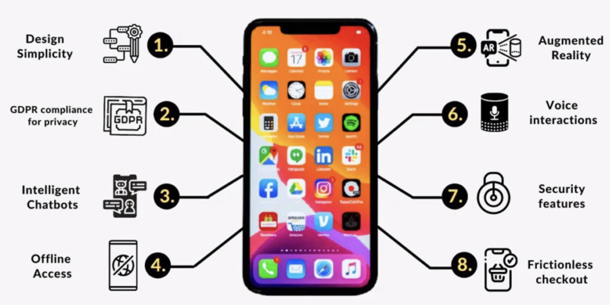

### 221021 특강
---

0. 모바일 앱 시장
    - 굉장히 크고 빠르게 성장하고 있으나 실제 시장의 모든 추정치가 합산되어 통계에 잡혀있지는 않다.
    - iOS, Android, Web ...
        - iOS는 디자인과 사용성에 민감한 대상으로 우선적으로 선택되는 분야다. 미국 진출을 의도한다면 더욱 그렇고.
    - 매년 20% 가량의 속도로 시장이 성장중

  
1. 웹에 대비하여 두각되는 모바일 앱의 특징

   - **디자인의 단순함**
   - **GDPR 개인정보 편리성**
   - 뛰어난 챗봇과 오프라인 접근성
   - 증강현실(위치 정보, GPS, 기본 정보와의 시너지)
   - 음성 상호작용(Siri)
   - 모바일 환경의 보안(특히 iOS는 앱 요구 정보에 대한 유저의 선택을 존중한다)
   - 결합 상태값의 자유로움

2. 앱은 어떻게 개발되는가

   - 기획과 연구
   - 기술적 가능성 검토
        - 기획자가 아니라 개발자가 해야 하며, 디자인 단계 시작 전에 검토가 완료되어야 한다.
        - 되도록이면 회의에 참여해서 가능 여부를 잘 따져야 한다.
    - 와이어프레임(스토리보드) -> 기획 내용을 덧붙여서 디자인
        - 이 단계들이 마무리되면서 피드백을 받아올 수 있는 기획이 준비되어 있어야 한다.
        - 기획에서 개발진이 목소리를 잘 내서 이 단계에서 잘 챙겨두어야 한다. 개발 도중에 불필요한 또 다른 개발이 끼어들면 개발 과정이 고단해질 수 있다.
    - 개발
    - 테스트
    - 배포(시장에 앱을 보내서 작동하는 양상 확인)
        - 리소스 연결과 서버 통신 등을 확인
    - 출시
    - 앱 피드백을 통한 개선

3. 왜 Native 앱인가?
    - **Performance 차이**
        - Data의 전처리
        - AI 활용(특히 iOS 환경은 기본 AI 칩을 제공하기 때문에 이를 활용하는 것은 중요하다)
    - **Feature의 최대화**
        - UX 요소
            - 제스쳐를 올바르고 효과적으로 통제하기 위해 Native가 중요
            - UX가 자연스럽지 않게 구현될 수 있기 때문
        - 자원 접근
    - **보안요소**
        - 기기 자체의 보안정보를 바탕으로 통신할 때 두드러지는 Native 개발의 안정성
        - 금융 앱은 대체로 웹뷰를 바탕으로 UI를 구성하지만 내부 로직은 Native로 보안요소를 확보한다.

4. 좋은 앱 개발자
    - **좋다? 상대적으로 뭐가 좋은가.**
        - 확실하고 객관적으로 상황을 판단하는 능력이 있어야 한다.
    - **상대성에 대한 이해가 중요하다.**
        - 내 역할은 무엇이고, 내가 할 일은 무엇인지 이해해야 부당한 책임을 질 일이 없다.
        - 업무 지시 또한 내 역할에 따라 구별해서 올바르게 내려야겠지.
    - **개발자로서의 자질**
        - 시스템을 이해하고 코딩하고, 그 결과가 잘 실행되는 것이 개발자의 목표라 하겠다. <- 기본이다.
        - 개발 실력과 자질도 어필이 굉장히 중요하다.
            - 정확한 용어를 사용해서 전달해야 하며 논리의 전개 또한 중요하다.
            - 생각해보면 스피치의 3요소만 잘 맞추면 어디가서 일 못한다고 소리 듣지 않는다.
    - **역할의 상대성 인식**
        - 조직 내의 내 역할이 무엇인지 이해하는 것
        - 내 주제를 알아야 조직 전체에 잘 어울릴 수 있다. 지나치게 저자세일 필요도, 지나치게 고자세일 필요도 없다.
    - **문서로 소통**
        - 개발자는 코드를 읽을 줄 아니까 코드 인수인계의 비중은 줄여도 괜찮다. 복잡한 로직이라면 설명을 해야겠지?
        - 남이 이해할 수 있는 문서를 만드는 것이 중요하다.
            - API 설명서, 앱 구동 제스쳐 시나리오 등등
        - 이 단계는 생각보다 어렵다. 레포트를 쓰는 것도 아니고 여러 직무의 사람들에게 내가 하는 일을 명료하게 보여주어야 하기 때문.
    - **회사는 잘 하는 개발자보다 좋은 개발자를 원한다.**
    - 깃헙과 readme 등등이 얼마나 잘 정리되어 있는지가 중요하다. 문서화가 잘 되어 있는가? 나는 어떻게 커뮤니케이션 하고 있는가? 개발자는 `코드==문서` 로 대화한다. 팀 프로젝트로 어떻게 했는지, 소통 중의 트러블슈팅은 어떻게 했는지 등등을 잘 기록해둔다.
    - 내 성향은 임기응변 상황에서 나온다. 문제 상황에서 많이 배우기 때문에 문제 상황에 쫄지 말자.
    - 내 마음가짐을 더 많이 어필하는 편이 신입에게는 영향력이 있다.
    - 해외취업의 경우 : 실력 < 개발 자체를 좋아하는 사람 채용 -> 기회가 올 때 능력 증명하기 -> 헤드헌팅은 커넥션이 유지되어야 가능함 // 인사담당자에게 레터를 보내보면 좋다.