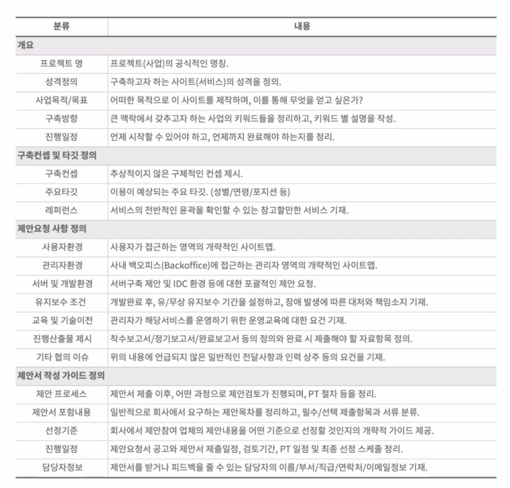
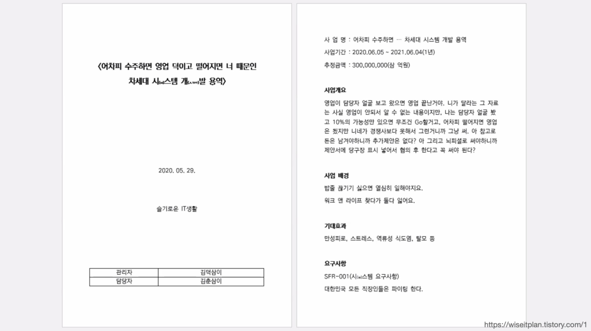
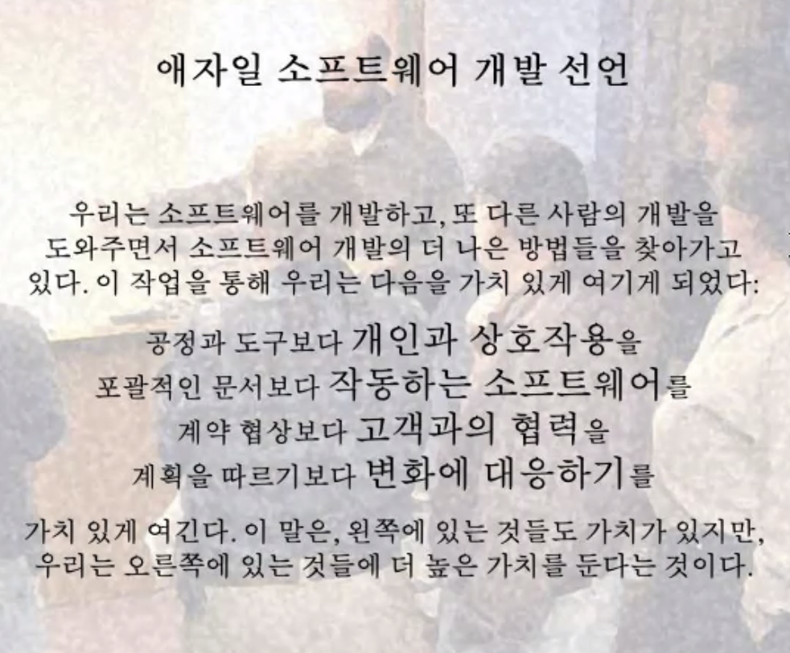

### 대형 서비스 구축 방식
1. 인하우스 : 내부 인력이 직접 개발
2. 아웃소싱 : 외부 인력을 용역 계약하여 개발

### RFP

1. 이렇게 만들어 달라는 기술 명세
2. 개요, 구축 컨셉, 제안 요청 사항 정리, 제안서 작성 가이드 정의
   

### PRD
- 제품 요구조건문서(기획과 영업이 할 일이긴 해)
   - 요약 및 배경 : 문제 정의와 중요성, 사업 지표, 인터뷰 내용, 기타 인사이트 자료를 첨부하여 설득하는 내용
   - 대상 사용자 : 제품 필요 사용자 정의, 그 사용자가 "중요한 이유"
   - 핵심 고객 여정(시나리오) : 고객 요구에 집중한 내용, 어떻게 서비스를 사용하는가.
   - 기능 정의 : 문제를 해결하기 위한 솔루션에 대한 설명, PM으로서 기능 요구 사항을 자세히 설명하는 것이 중요하지만 특정 솔루션을 지시하지는 않음.
   - 시장 진출 : 기능이 출시되는 방식에 대한 고려 사항과 마케팅, 영업, 고객 지원 및 기타 사용자 대면 기능에 대한 기대치
   

---
### 그외
1. 사실 스타트업 환경에서는 문서 만들 시간이 없다.
   