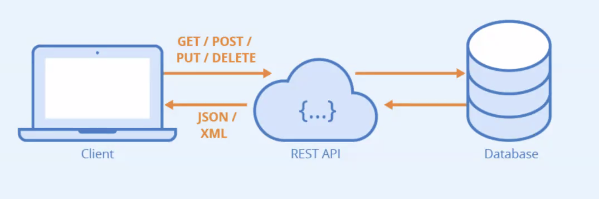
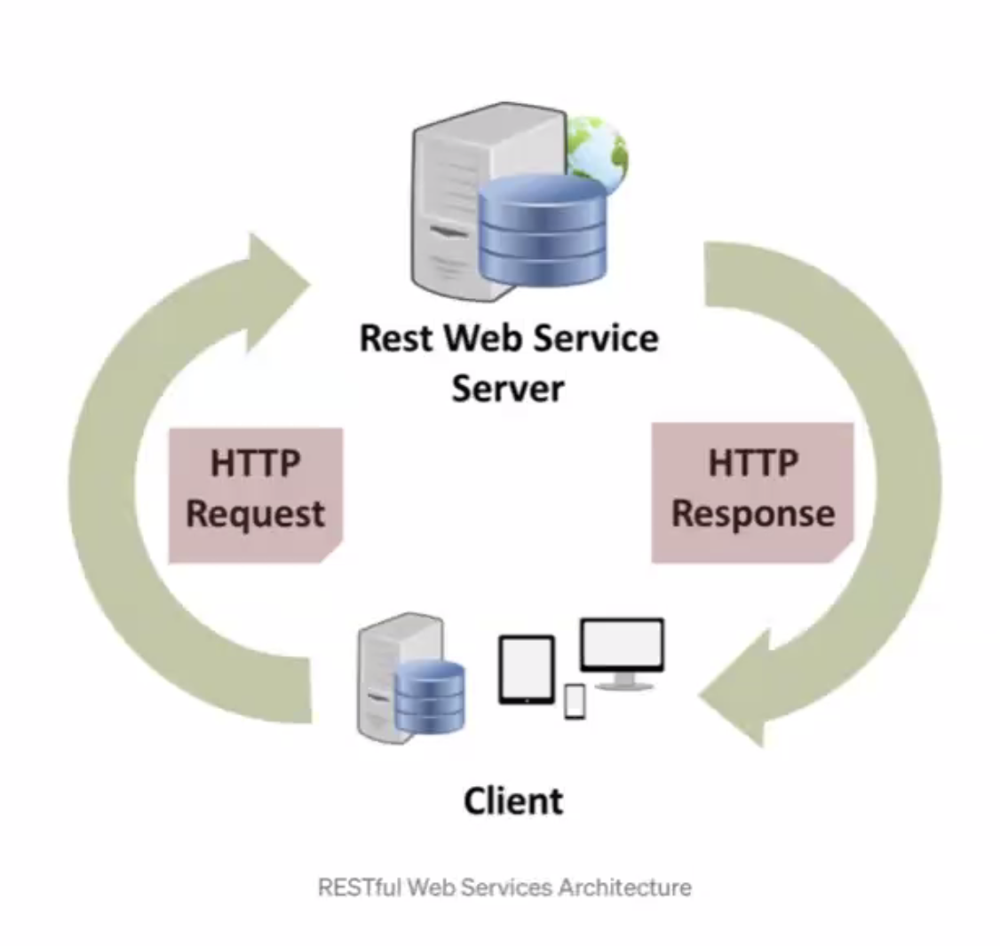
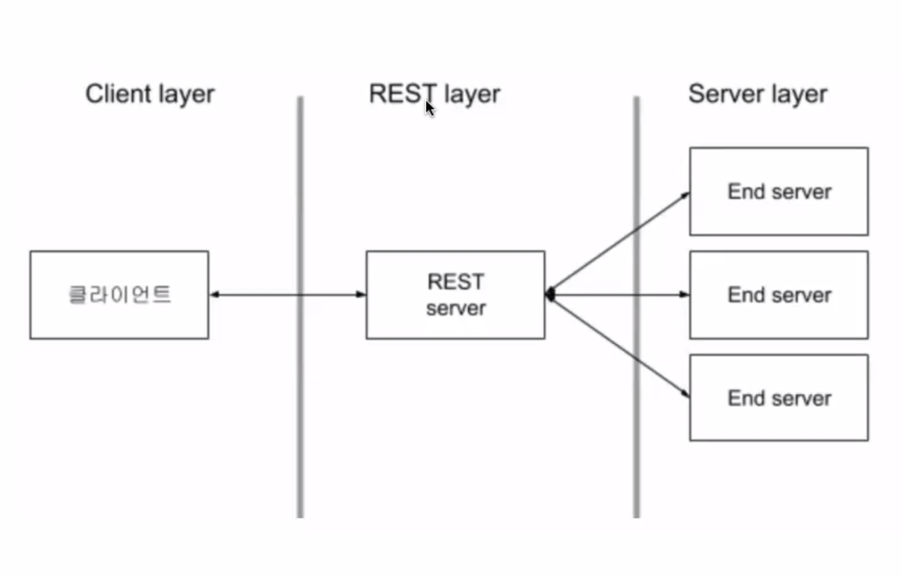

### 서버 코딩
---
1. 서버 자체는 코딩만으로 끝나지 않는다.
    - 서버에 심어서 코드가 작동하게 해야 하는데, 여러 상황이 발생할 수 있어서 관리해야할 내용이 많다.
    - 서버를 어디에 둘 건가? 클라우드에 둘건가? 도커? 이아스? 등등
    - 서버 운영비는 어떻게 할 건가?
2. 프로젝트 단계에서는 파이어베이스 무료 플랜으로 해결이 될 것으로 보인다..
    - 최종 프로젝트에는 AWS 등 자유도가 주어지긴 할 텐데, 아마 도움받긴 어려울 것.
3. 프론트엔드(클라이언트) : App / Web - Swift, JS, Dart, Kotlin으로 개발이 가능하다.
4. 백엔드(서버) : Server / DB - Java, Ruby, JS 등으로 개발
    - PHP, .Net, Java, RoR, 쟝고, Node.js, Docker 등등 많은 선택지가 있다.
        + 도커는 다른 스택과 조금 느낌이 다른데, 단일 API를 관리하는 컨테이너 느낌이다.
    - 서버 개발은 "무정지 상태"를 상당히 경계해야 하기 때문에 개발 스택 선택에서도 선택지가 갈린다.
    - 1년 중 무정지 상태를 기준으로 실력을 나눈다는(?) 개발 밈이 있다.

### Swift와 Vapor
---
- Swift로 서버를 왜 만들어야 할까?
    + 빠르게 준비할 수 있고 자원 효율화가 가능하기 때문.
    + 일단 백엔드를 지원하는 프레임워크가 애초부터 있었다.
        * `Perfect`, `Kitura`, `Vapor`
        * Swift 2.0 - 3.0 시절엔 서로 경쟁이 붙기도 했었는데 지금은 거진 Vapor 밭이다.
        * 키투라는 IBM이 철수해서 발전이 미진한 편이고, 퍼펙트는 Swift의 변화에 기민하게 반응하질 못했다.
        * 최근엔 아마존 람다(서버리스)가 서버 시장에 합류했다.

- Vapor의 기본 기능 :
    + HTML, CSS, JS의 백엔드 구현(Vapor 단독으로는 조금 어렵다.)
    + JSON, XML 웹 API 서버 구현 가능(App 단에서 활용 가능)
    + **APNS(apple notification server 잠금화면 알람)**, Postgres(DB), MySQL(DB), SQLite(CoreData는 SQLite와 닮았다), MongoDB, Redis(메모리DB, 비쌈), JWT(Json Web Token, 인증) ...
    
- 간단한 서버 개념 :

- RESTful API :
    - Representational State Transfer
    - 두 컴퓨터 시스템이 인터넷으로 정보를 안정하게 교환하기 위해 사용하는 인터페이스.
    
    - 소프트웨어 프로그램 아키텍처의 한 형식
    - 자원을 **이름**으로 구별해서 자원 상태를 주고받는 모든 것이며, WWW 같은 분산 아이퍼미디어 시스템을 위한 SW 개발 아키텍쳐
    - 웹 기존 기술과 HTTP 프로토콜을 그대로 활용하기 때문에 웹 장점을 최대로 활용할 수 있다.
    - 주소 이름만으로 어떤 정보를 주고받을지 확인할 수 있다는 장점 
    - Not Restful : 공공데이터 API 가 이꼴이었다.  
    URL1 : `https://api.humanPopuluation.org/data`  
    URL2 : `https://api.humanPopuluation.org/data/header : state=seoul&country=gangnam`  
    Data : `.JSON`
    - RESTful : api 호출의 목적이 애초에 드러나는 api, URL 자체가 정보를 다 담고 있다.  
    URL1 : GET - `https://api.humanpopulation.org/seoul/gangnam/yeoksam`  
    URL2(Rest인 척하는 api, 이건 사실상 api 메인 도메인은 동일한 형태): `https://api.humanpopulation.org/get/seoul/gangnam/yeoksam` 

- HTTP URI로 자원을 명시하고 POST, GET, PUT, DELETE등 명령어로 CRUD OPERATION 적용

- 자원 기반 구조 설계 중심에 Resource가 있고 HTTP Method로 자원을 처리하는 아키텍쳐가 곧 RESTful이며 **각 자원의 고유한 id로 자원을 표현한다는 점**이 핵심.

---

> **RESTFUL의 조건** :  
> 자원(Resource-URL, 자원을 구별하는 id, 서버에 존재),  
행위(HTTP METHOD), 
표현(Representations) : Client의 요청에 대한 서버의 응답(JSON, XML 등등)

1. 인증 TOKEN에 의한 State-Less
2. 정확히 구별되는 HTTP 요청 : GET, PUT, DELETE, UPDATE
3. URL을 통해 명확히 드러나는 자원 대상
4. 자의적인 JSON 컨벤션을 작성하지 않도록 주의

---

- **STATE-LESS**
    - 서버 입장에서는 누군가 접속하고 통신이 유지될 때가 안전하다.
    - 그러나 인터넷 입장에서 값을 계속 유지하고 있기는 힘들다.
        - 인터넷은 전화처럼 연속적이지 않다. 
    - Stateless는 비연속성을 의미한다.
        - 통신량을 줄여서 필요한 데이터만 갖고 통신할 수 있다.
        - 서비스 사용자가 많을수록 서버도 많아지고 분산화되는데, Stateless하게 통신하지 않으면 서버가 터지는 상황이 날 수도? 있다.
        - 접속할 때마다 각 서버의 상태에 따라 접속할 서버가 바뀔 수 있음을 의미.
        - 모든 서버가 열려있다는 상태를 가정하는 건 어불성설이니까, STATELESS한 통신이 될수록 효율적이다.
        - 서버는 TOKEN을 발급해서, 나중에 새로운 요청과 함께 보내게 되는데 토큰에 따라 서버가 바뀌더라도 통신 정보를 잃지 않을 수 있다.
        - 토큰은 JWT(보안과 인증)와도 연관이 깊다.

- **JWT**
    - JSON WEB TOKEN은 오픈소스로, 웹 토큰을 활용한 유저 인증 및 유효성 관리 를 위한 용도로 활용된다.
    - 암호화된 토큰으로 유저의 정보를 인증하고 확인할 수 있다.
    - 웹 정보의 주민등록번호라고 생각해도 좋다.
    - 이 토큰은 서버 어딘가에 저장되는데 얼마나 길게 그리고 어디에 저장하는가가 환경에 따라 서로 다른 이슈를 만든다.
---
### 근황
- 최근엔 멀티 디바이스, 플랫폼 시대로 넘어온지 한창이라 서로 다른 앱 간의 통신에 대응이 가능해야 한다.
- 최대한 단순하면서도 효율적, 범용적인 서버 통신 디자인이 필요하게 되었다.
- RESTful 한 설계가 이러한 통신의 기반을 지지하고 있다.
    - 곁다리 - WinSock : MS가 만든 윈도우 서버 통신 디자인인데, 초기 게임 설계나 통신에 곧잘 활용되었다. 지연 없이 동시적인 게임이 가능하다는 장점이 있었다. 그런데 다른 플랫폼 환경이 들어온 이후론... ㅠ 그냥 윈도우 pc 환경에서만 쓰이고 잇다고 한다.
- 현재는 플랫폼에 맞춘 새로운 서버를 만들 필요가 없는 RESTful한 서버 설계가 각광받게 되었다. Client를 정형화된 플랫폼에 제한하지 않고 메시지 기반, XML, JSON 등 Client에서 곧바로 치환 가능한 형태의 통신을 지향하면서 Server와 Client가 더 분리되기 시작한다.
- HTTP 표준 규약을 잘 지키는 API 설계는 기본 중의 기본이 되었다.
---

### REST 구조

[참고링크](https://meetup.toast.com/posts/92)  
[서버 스위프트](https://www.serversideswift.info/)  
[풀스택 스위프트](https://www.youtube.com/watch?v=fpWOD3JpSrI&list=WL&index=16)

