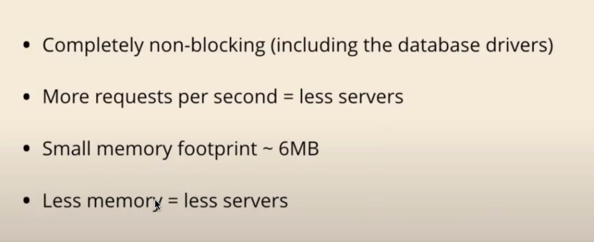

### VAPOR
---

- Tanner Nelson이 개발한 오픈소스 웹 프레임워크, Vapor 는 SwiftNIO(기반 기술언어) 로 개발되었다.
- 개발자의 만족도와 기능을 함께 잡기 위해 등장했다!
    - Firebase로 프로젝트를 진행하다가 기능 지원이 안 될 때 Vapor 자체 서버를 만드는 것도 나쁘진 않지. Vapor 구축을 위한 기반 코드가 많긴 하다.


### Vapor의 장점

- 결론적으로 서버를 최소화하면서도 확실한 효율성을 챙길 수 있다!(근데 이걸 기계적으로 외울 게 아니라 비교를 해야될 것 같은데)
- 우분투, 도커, 헤로쿠 환경에서 Vapor 운영-배포가 가능하다.
    - 벤츠, 네덜란드왕립은행, NODES, Allegro, Amazon, BBC 등등 스위프트를 기반으로 한 제품이 있다.
- WWDC 2022에도 서버 개발 세션이 있다.
    - 과거에는 Vapor를 쓰지 않고 바닐라 스위프트로 했다가, 2022부터 Vapor로 서버 개발 세션을 소개하기 시작했다.
    - 외부 서비스가 WWDC에서 소개된 첫 사례

---
### Basics
- `vapor new hello -n` 명령어로 기본 템플릿 생성 가능
- 당장은 `routes.swift` 만 만지면 된다.
- 기본적인 라우팅으로 이런 게 가능하다. 이렇게 하진 않겠지만
  ```swift
  app.get("id", ":id", "password", ":pass") { req async -> String in
		let id = req.parameters.get("id")!
		let pass = req.parameters.get("pass")!
		
		if id == "myUserId123",
		   pass == "myUserPass123" {
			return "Welcome"
		}
		
		return "You Can't access"
	}
  ```
- Content 프로토콜을 채택해서 내가 원하는 데이터를 서버 연산을 한 다음 내보낼 수 있다.