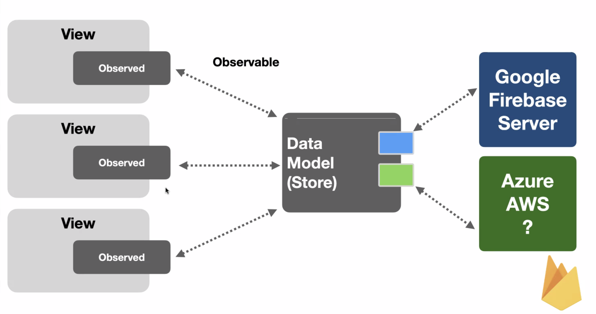
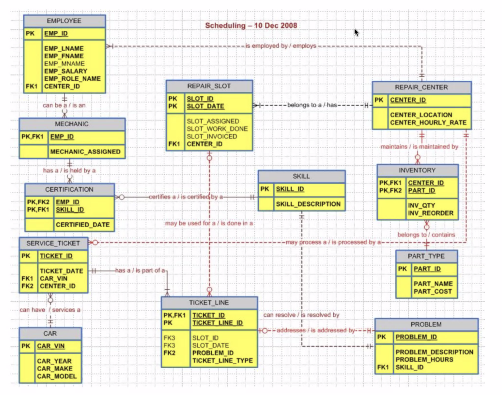

### Cloud Computing과 Server

### 대표적인 클라우드 컴퓨팅 서비스
- Infra as-a Service
    - 가상머신을 제공받으면 그 머신에서 OS, Middleware, Framework, Code를 내가 직접 관리하고 올려서 배포한다.
    - 개발자가 관여할 일이 더 많은 서비스.
    - Amazon이 대표적이었으나 Paas의 방향으로 노선이 바뀌는 중.

- Platform as-a Service
    - 내가 관리할 서버의 코드만 올리면 된다.
    - 플랫폼을 전부 주기 때문에 관리가 편하다.

- Backend as-a Service
    - 업체가 준비한 백엔드 자체를 전부 준다.
    - 서비스를 배포하는 앱 자체만 관리하면 되고 이걸 서버와 연결하기만 하면 된다.
    - 다만 자유도는 떨어지는 편, 이 문제 때문에 개선이 이루어지고는 있다.
    - 대표적인 서비스로는 `Parse`가 있다(파싱할 때 그 파싱 아님).
        - 현재는 아쉽게도 "오프소스", 서비스종료가 되었다.

---
### 앱 기획에서의 데이터 설계
- 기획은 데이터 설계와 서버 개발부터 해야 한다.
    - 어떤 서버, 어떤 db를 어떻게 UI와 연결할 것인지...
    - 잘 짜여진 기획 만큼 중요한 건 없다.
    - 서버 비용도 중요하게 고려해야 할 필요가 있다.
- Baas를 선택하면 바로 프론트엔드 개발로 진입해도 괜찮다.
    - 물론 흐름도 자체는 그려야겠지..?

---
### Firebase
- 백엔드 지식 없이 시작할 수 있고 개발 중 비용은 거의 들지 않는다.
- iOS, Android 등등 여러 프론트 플랫폴을 지원하고 ML 기능도 활용할 수 있다.
- 무려 구글이 제공하는 서비스
- 이런 식으로 중간 모델을 두고, 그 모델이 클라우드랑 통신하면 통신량을 조절하면서도 효과적으로 데이터 흐름을 관리할 수 있다.
  

---
### RDBMS
> Relational Database Management System

- Oracle, MS SQL Server, IBM DB2, SAP HANA
- MySQL, MariaDB, PostgreSQL, SQLite

- 관계형 데이터베이스의 특성은 데이터의 **"정규화"**에 있다.
    + 각 데이터 간의 중복과 단일 값을 바탕으로 정규화가 이뤄지기 때문에 데이터의 공백이 있어선 안 된다.
        * 공백이 있을 수도 있지만... 여러 테이블에서 데이터를 가져올 때 매우 불편해질 수 있다.
    + 하나의 테이블은 다른 테이블에서 또 다른 정보를 갖는다.
    
    + 학습량이 많다는 단점과 비즈니스 DB에 따라 구조 변경이 어려울 수 있다는 단점이 있다(정규화로 인해 테이블 분리가 많이 일어나면 일어날수록).

- 위의 사진과 같이 복잡한 구조를 갖는 데이터베이스에서 원하는 데이터를 뽑아내기 위해 등장한 언어가 SQL이다.
  
---
### NoSQL(Not Only SQL)
> 관계형 DB가 아닌 모든 DB

- 딱히 표준이 있지는 않지만 RDBMS의 범주에 속하지 않는 영역.
- 굉장히 유연한 스키마 구현이 가능하다. RDBMS가 채우지 못한 확장성에서 두각을 드러낸다는 장점
    - 유연성, 확장성, 고성능, 고기능성
- id와 ISBN을 기준으로 데이터 정규화가 이뤄지는 RDBMS에 비해, JSON 으로 데이터를 정리하는 경향이 두드러진다.
    - 키 밸류, JSON, 객체 형식 등등... 개발자 친화적인 형태가 많다.
- Wide Column Store : 덜 제한적인 일관성 모델로 유연함과 확장성을 자랑하지만.. 데이터 손실이 벌어지거나 느려지기도 한다.
- Document : 모든 데이터를 문서로 저장, Hadoop 빅데이터 분석 시스템과 통합되기도 한다. MongoDB, Couchbase, FireStore
- Key-value : 모든 데이터를 Dictionary로 저장, key로 value에 빠르게 접근할 수 있다. Redis, Amazon DynamoDB
- Graph : 시맨틱 쿼리를 위해 node, edge, property와 함께 그래프 구조로 저장(1960년대 COBOL 시대부터 유래), Neo4J, AgensGraph

---
### Realtime DB vs FireStore
- RealtimeDB는 원조 격으로서, 실시간 클라이언트 동기화를 요구하는 모바일 앱을 위한 효율적이고 지연 시간이 짧은 솔루션이었다.
- 그러나 realtime DB는 데이터를 JSON이 받아들일 수 있는 형식만 저장할 수 있었다.
    - String, Int...
    - 구조에 따라 기반코드가 많이 복잡해지는 경향
- FireStore는 Document 기반 NoSQL DB!
    - 완성도가 높아서 제품을 완성할 때에도 쓸 수 있을 정도.
    - 로컬에서 확인가능한 에뮬레이터도 존재
    - 따지고 보면 FireStore 안에 realtimeDB가 속하는건가 싶기도 하고
- FireStore는 새롭고 직관적인 데이터 모델을 지원하고 RealtimeDB 이상의 풍부하고 빠른 쿼리, 확장성을 제공한다.

---
### FireStore
- 각각의 Collection이 있고 그 내부에는 서로 다른 형식의 데이터가 담길 수 있다.
    - 각 Collection에는 Document가 담기며, 각 콜렉션은 하위에 Sub Collection을 가질 수 있다.
    - JSON 이상의 모든 데이터(document 형태)가 담길 수 있다.
    - Document의 이름은 중복될 수 없고 Field:Value 한 쌍의 데이터 타입이 들어간다.